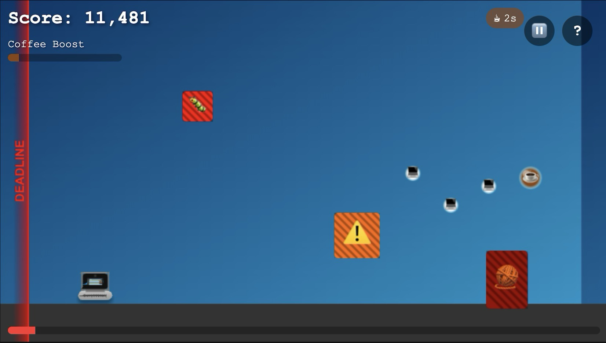

# Mac the Developer

Created as a fun browser-based project to combine coding themes with classic endless runner gameplay. Players control a developer laptop racing against deadlines while collecting power-ups and avoiding bugs and technical obstacles.

Perfect for people who need a quick break from actual coding!

## Play the Game

1. Clone this repository
2. Open `index.html` in your browser
3. Click "START GAME" to begin
4. Race against the deadline and collect resources!

## Game Controls

### Desktop Controls

- **Jump**: Space bar, Up arrow, or click in the upper zone of the screen
- **Double Jump**: Press Space/Up twice quickly or double-click in the upper zone
- **Slide**: Down arrow or click in the lower zone of the screen
- **Pause**: Press P, Escape key, or click the pause button (⏸️)
- **Help**: Click the "?" button or press H key
- **Restart**: Press Space/Enter when game over, or click "TRY AGAIN"

### Mobile Controls

- **Jump**: Tap the upper control zone
- **Double Jump**: Double-tap the upper control zone
- **Slide**: Tap and hold the lower control zone
- Visual indicators show the jump and slide zones for easy control

## Features

- Endless runner gameplay with progressive difficulty
- Software development themed obstacles and collectibles
- Responsive controls for both desktop and mobile devices
- Visual feedback for all game actions
- Speed boosts and power-ups
- Deadline mechanic that approaches if you slow down
- High score tracking with local storage
- Pause functionality with on-screen controls
- Comprehensive help screen with game instructions
- Beginner-friendly first phase with reduced difficulty

## Game Elements

### Collectibles (With Visual Indicators)

- **Coffee (☕)**: Speed boost power-up that also slows down the deadline
  - Unique bobbing animation for visibility
  - Temporary speed increase effect
- **Stack Overflow (🛡️)**: Grants temporary invincibility
  - Pulsing visual effect
  - Protection from obstacles
- **Git Commits (📌)**: Bonus points
  - Rotating animation
  - Score multiplier
- **Code Snippets (💻)**: Basic scoring items
  - Clear visual indicator
  - Points reward

### Obstacles (Avoid These)

- **Bugs (🐛)**: Moving enemies that crash your character
  - Variable movement patterns
  - Instant game over on collision
- **Merge Conflicts (⚠️)**: Large obstacles that must be avoided
  - Distinct warning visuals
  - Blocks player progress
- **Meetings (👥)**: Slow down the player when hit
  - Temporary speed reduction
  - Can be recovered from
- **Technical Debt (🧶)**: Complex obstacle with growing impact
  - Progressive difficulty
  - Must be avoided

## Gameplay Tips

- Watch for visual cues that indicate collectible types
- Use the dedicated control zones for precise movement
- Coffee power-ups are crucial for maintaining speed
- Stack Overflow invincibility can help in tight situations
- Monitor the deadline bar to maintain your pace
- Use the pause feature (⏸️) when needed
- Check the help screen (?) for detailed instructions

## Technical Implementation

- Built with vanilla JavaScript and HTML5 Canvas
- Responsive design with dedicated mobile controls
- Sprite-based animation system
- Local storage for high score persistence
- Optimized for both touch and mouse/keyboard input
- Clean separation of game components (UI, physics, controls)
- No external dependencies required

## Development

The game is structured into multiple JavaScript modules:

- `main.js`: Game initialization and setup
- `game.js`: Core game loop and state management
- `player.js`: Player character controls and physics
- `collectibles.js`: Power-up and scoring items
- `obstacles.js`: Obstacle generation and behavior
- `level.js`: Level design and difficulty progression
- `ui.js`: User interface and HUD elements
- `assets.js`: Game assets and resource management
- `utils.js`: Utility functions
- `sprites.js`: Sprite animation system

## License

This project is open source and available under the MIT License.
